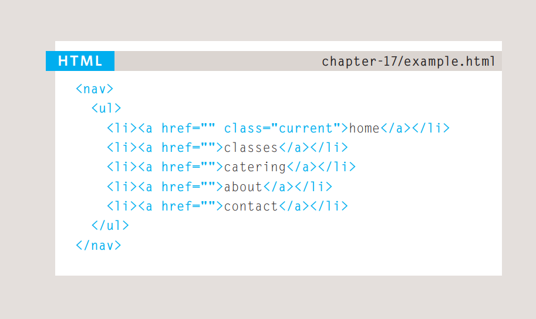

# HTML structure 
*Many web pages act like electronic versions of these 
documents. For example, newspapers show the same stories 
in print as they do on websites; you can apply for insurance 
over the web; and stores have online catalogs and e-commerce 
facilities.*

## How Pages Use Structure?

*a newspaper: for each 
story, there will be a headline, 
some text, and possibly some 
images. If the article is a long 
piece, there may be subheadings 
that split the story into separate 
sections or quotes from those 
involved. Structure helps readers 
understand the stories in the 
newspaper.*

### Body

*Everything inside this element is 
shown inside the main browser 
window.*

### head

*information that is shown within 
the main part of the browser are written right here*

### title 

*The contents of the **title**
element are either shown in the 
top of the browser, above where 
you usually type in the URL of 
the page you want to visit*

## Extra Markup

### DOCTYPEs
*Because there have been 
several versions of HTML, each 
web page should begin with a 
DOCTYPE declaration to tell a 
browser which version of HTML 
the page is using (although 
browsers usually display the 
page even if it is not included). 
We will therefore be including 
one in each example for the rest 
of the book.*

### Comments in HTML

*If you want to add a comment 
to your code that will not be 
visible in the user's browser, you 
can add the text between these 
characters:
"!-- comment goes here --" between angle brackets.*

## HTML5 Layout

### Traditional HTML Layouts

*For a long time, web page authors used div elements to group 
together related elements on the page (such as the elements that form a 
header, an article, footer or sidebar). Authors used class or id attributes 
to indicate the role of the div element in the structure of the page.*

### New Html5 Layout Elements

*HTML5 introduces a new set of elements that allow you to divide up the 
parts of a page. The names of these elements indicate the kind of content 
you will find in them. They are still subject to change, but that has not 
stopped many web page authors using them already*

### Navigation

*The nav element is used to 
contain the major navigational 
blocks on the site such as the 
primary site navigation.
Going back to our blog example, 
if you wanted to finish an article 
with links to related blog posts, 
these would not be counted as 
major navigational blocks and 
therefore should not sit inside a nav element*

## Process & Design

### Who is the Site For?

*Every website should be designed for the 
target audience—not just for yourself or the 
site owner. It is therefore very important to 
understand who your target audience is.*

*It can be helpful to ask some 
questions about the people you 
would expect to be interested in 
the subject of your site.
If you ask a client who a site is 
for, it is not uncommon for them 
to answer "the entire world."*

### Why People Visit YOUR Website

*Now that you know who your visitors are, you 
need to consider why they are coming. While 
some people will simply chance across your 
website, most will visit for a specific reason*

*Your content and design should 
be influenced by the goals of 
your users.*

# The ABC of programming

## A What is a script and how do I create one?

*A script is a series of instructions that a 
computer can follow to achieve a goal. 
You could compare scripts to any of the following:*
<ul>
<li>RECIPES</li>
<li>HANDBOOKS</li>
<li>MANUALS</li>
</ul>

### WRITING A SCRIPT

*To write a script, you need to first 
state your goal and then list the 
tasks that need to be completed in 
order to achieve it.*

## B How do computers fit in with the world around them? 

*A computer has no predefined 
concept of what a hotel or car is. 
It does not know what they are 
used for. Your laptop or phone 
will not have a favorite brand of 
car, nor will it know what star 
rating your hotel is.*

### HOW A BROWSER SEES A WEB PAGE 
*n order to understand how you can change the content of an HTML 
page using JavaScript, you need to know how a browser interprets the 
HTML code and applies styling to it.*

## C How do I write a script for a web page?

*Before diving into the JavaScript language, you 
need to know how it will fit together with the 
HTML and CSS in your web pages.*

*Web developers usually talk 
about three languages that 
are used to create web pages: 
HTML, CSS, and JavaScrip*

*Where possible, aim to keep the 
three languages in separate files, 
with the HTML page linking to 
CSS and JavaScript files.*

*Each language forms a separate 
layer with a different purpose. 
Each layer, from left to right. 
builds on the previous one.*

