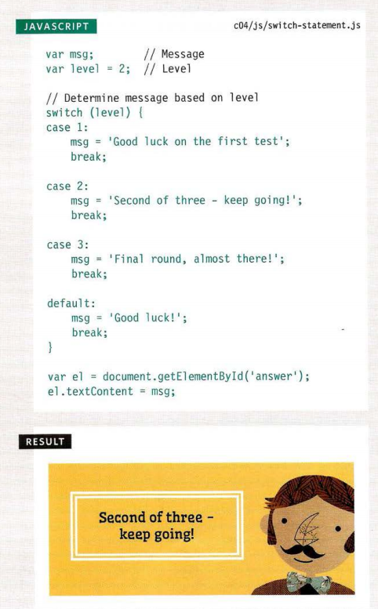
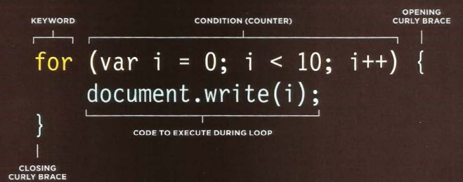

# Lists
there are two types of lists:
1. ## ordered lists
1. ## Unordered lists

The ordered list is created with 
the <b>ol</b> element.

Each item in the list is placed 
between an opening **li** tag 
and a closing **li**

The unordered list is created  
with the **ul** element.

and the same Each item in the list is placed 
between an opening **li** tag 
and a closing **li**

## Definition Lists

definition list is created with 
the **dl** element and usually 
consists of a series of terms and 
their definitions.

**dt** This is used to contain the trm 
being defined 

**dd** This is used to contain the 
definition.

# boxes
By default a box is sized just big 
enough to hold its contents. To 
set your own dimensions for a 
box you can use the height and 
width properties.

When we use percentages, 
the size of the box is relative to 
the size of the browser window 
or, if the box is encased within 
another box, it is a percentage of 
the size of the containing box.

## Overflowing Content
1. ### overflow
1. ### hidden
1. ### scroll

## border-style

we can control the style of a 
border using the border-style
property.

## border-color

we can specify the color of a 
border using either RGB values, 
hex codes or CSS color names

## Padding
we can specify how much space 
should appear between the 
content of an element and its 
border. 

## Margin 

The margin property controls 
the gap between boxes. Its value 
is commonly given in pixels.

## Centering Content

In order to center a box on the 
page, you need to set a width
for the box, Once you have specified the 
width of the box, setting the left 
and right margins to auto will 
make the browser put an equal 
gap on each side of the box

## Change Inline/Block

* display
* inline
* inline-block
* none

CSS treats each HTML element as if it has its own box. 
and You can use CSS to control the dimensions of a box.
also You can also control the borders, margin and padding 
for each box with CSS.

# CREATING AN ARRAY

Arrays are especially helpful 
when we do not know how 
many items a list will contain 
because, when you create the 
array, you do not need to specify 
how many values it will hold. 

## EXPRESSIONS

An expression evaluates into (results in) a single value. Broadly speaking 
there are two types of expressions. 

# USING IF ... ELSE STATEMENTS 

if ... else statement allows you 
to provide two sets of code: 
1. one set if the condition 
evaluates to true 
2. another set if the condition is 
false 

## SWITCH STATEMENTS

A switch statement starts with a 
variable called the switch value. 
Each case indicates a possible 
value for this variable and the 
code that should run if the 
variable matches that value. 

## SHORT CIRCUIT VALUES 

Logical operators are processed left to right. 
They short-circuit (stop) as soon as they have a 
result - but they return the value that stopped 
the processing (not necessarily true or false

## Loops

loops check a condition if it return true  the code block will run, then the condition will be checked again ,it repeat until the condition return false.

## USING FOR LOOPS 

A for loop is often used to loop 
through the items in an array. 

## USING WHILE LOOPS

This loop will continue to run 
for as long as the condition in 
the parentheses is true.

## USI NG DO WHILE LOOPS

The key difference between 
a whi 1 e loop and a do whi 1 e 
loop is that the statements in 
the code block come before the 
condition. This means that those 
statements are run once whether 
or not the condition is met. 