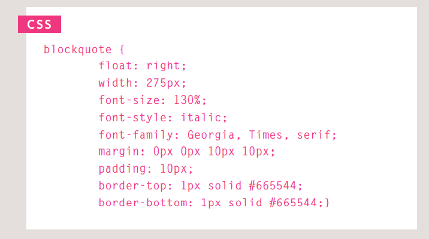

<h1 style='color:red; background-color:blue'>Links </h1>

The **a** tag defines a hyperlink, which is used to link from one page to another.

between the opening **a** tag and the closing **a** tag.The text between the opening tag and closing tag 
is known as link text.
link text should explain where visitors will be taken if they click on it
the a tag has an atribute called <b> href</b>

<h2 style='color:red'> Linking to Other Pages on the Same Site</h2>

When you are linking to other 
pages within the same site, 
you do not need to specify the 
domain name in the URL. You 
can use a shorthand known as a 
relative URL.

<h2 style='color:red'> Relative URLs </h2>

Relative URLs can be used when linking to pages within your own 
website. They provide a shorthand way of telling the browser where to 
find your files.
<h2 style='color:red'> Email Links</h2>

To create a link that starts up 
the user's email program and 
addresses an email to a specified 
email address, you use the **a**
element.

<h2 style='color:red'> Opening Links ina New Window</h2>

If you want a link to open in a 
new window, you can use the 
target attribute on the opening 
**a** tag. The value of this 
attribute should be _blank.

<h2 style='color:red'> Linking to a Specific Part of the Same Page</h2>

To link to an element that uses 
an id attribute you use the **a**
element again, but the value of 
the href attribute starts with 
the # symbol, followed by the 
value of the id attribute of the 
element you want to link to.

<h2 style='color:red'> Layout</h2>

CSS treats each HTML element as if it is in its 
own box. This box will either be a block-level
box or an inline box.

<h2 style='color:red'> Containing Elements</h2>

If one block-level element sits inside another 
block-level element then the outer box is 
known as the containing or parent element

<h2 style='color:red'> Floating Elements</h2>

<h3 style='color:green'> float</h3>
The float property allows you 
to take an element in normal 
flow and place it as far to the 
left or right of the containing 
element as possible.
The **blockquote** element 
is floated to the right, and the 
paragraphs that follow the quote 
flow around the floated element.

<h3 style='color:green'> clear</h3>
* left
* Right
* both
* none

<h3 style='color:green'> Screen Sizes</h2>

Different visitors to your site will have different sized screens that show 
different amounts of information, so your design needs to be able to 
work on a range of different sized screens.

<h2 style='color:red'> Screen Resolution</h2>

Resolution refers to the number of dots a screen shows per inch. Some 
devices have a higher resolution than desktop computers and most 
operating systems allow users to adjust the resolution of their screens.

<h3 style='color:green'> Page Sizes</h3>

Because screen sizes and display resolutions vary so much, web 
designers often try to create pages of around 960-1000 pixels wide 
(since most users will be able to see designs this wide on their screens)

<h1 style='color:red; background-color:blue'> Pair programming
 </h1>
Iterative loops. Code reviews. Fast feedback. Error checking and linting. These are software engineering practices that have proven to dramatically improve the quality of code developers produce.

While there are many different styles, pair programming commonly involves two roles: the Driver and the Navigator. The Driver is the programmer who is typing and the only one whose hands are on the keyboard.

<h2 style='color:red'> why pair program?</h2>

1. Greater efficiency
2. Engaged collaboration
3. Learning from fellow students
4. Social skills
5. Job interview readiness
6. Work environment readiness
