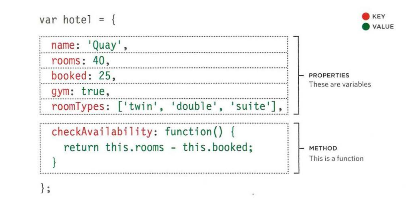
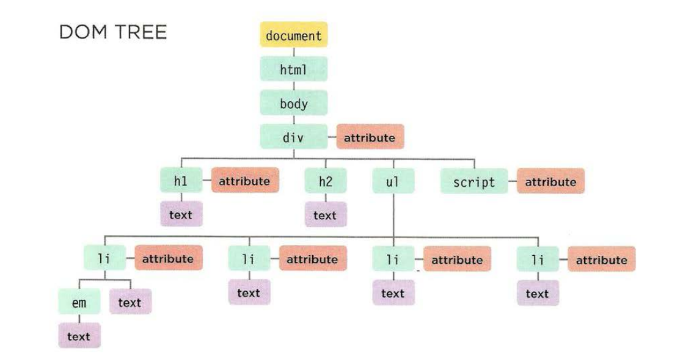

# understanding the problem domain is the hardest part of programing.

<h3> what is the hardest thing of writing a code?</h3>

there are to many common to answer this question :

* Learning a new technology
* Naming things
* Testing your code
* Debugging
* Fixing bugs
* Making software maintainable

## A familiar problem
In a good portion of my Pluralsight courses I show the viewer how to build the “Protein Tracker” application.

I am often asked why I keep demonstrating how to build the same simple application over and over again in each of my courses.

The answer is “familiarity.”

When I first started using the Protein Tracker example in my Android course, I was just looking for a simple example of an application that could be easily understood and implemented.

# WHAT IS AN OBJECT?

objects are group of variables and functions to create a modle of a something you would recognize from the real world.

If a variable is part of an object, it is called a 
property. in an object: variables become knowen as a properties

in an object: variables become knowen as a methods.

## Acceseing an object and dot anotation

to accesss property or method of an object use the name of the object, followed by period then the name of the property or the method you want to access.

# THE DOM TREE IS A MODEL OF A WEB PAGE

As a browser loads a web page, it creates a model of that page. 
The model is called a DOM tree, and it is stored in the browsers' memory. 
It consists of four main types of nodes.

## ACCESSING ELEMENTS

getElementByld(' id')

querySel ector( 'css selector')

getEl ementsByClassName( ' class ' ) 

getEl ementsByTagName( 'tagName ')

querySelectorAll ( ' css select ')

## LOOPING THROUGH A NODELIST 

Each time the loop runs, the 
script checks that the counter 
is less than the total number of 
items in the Nodelist. 

## VALIDATE INPUT GOING TO THE SERVER 

1. Only let visitors input the kind 
of characters they need to when 
supplying information. This is 
known as validation. 

2. Double-check validation on 
the server before displaying user 
content/storing it in a database

3. The database may safely 
contain markup and script 
from trusted sources (e.g., your 
content management system).

## XSS: ESCAPING & CONTROLLING MARKUP

Any content generated by users that contain characters that are used 
in code should be escaped on the server. You must control any markup 
added to the page.

### ESCAPING USER CONTENT

All data from untrusted sources should be escaped 
on the server before it is shown on the page. 

## ADDING USER CONTENT 

When you add untrusted content to an HTML page, 
once it has been escaped on the server, it should still 
be added to the page as text. 

# EVENTS

W hen you browse the web, your browser registers different 
types of events. It's the browser's way of saying, "Hey, this 
just happened." Your script can then respond to these events. 

## INTERACTIONS CREATE EVENTS

Events occur when users click or tap on a link, hover or swipe over an element, t ype on the keyboard, resize the window.

## EVENTS TRIGGER CODE 

When an event occurs, or fires, it can be used to trigger a particular function.

## CODE RESPONDSTO USERS 

In the last chapter, you saw how the DOM can be used to update a page. 