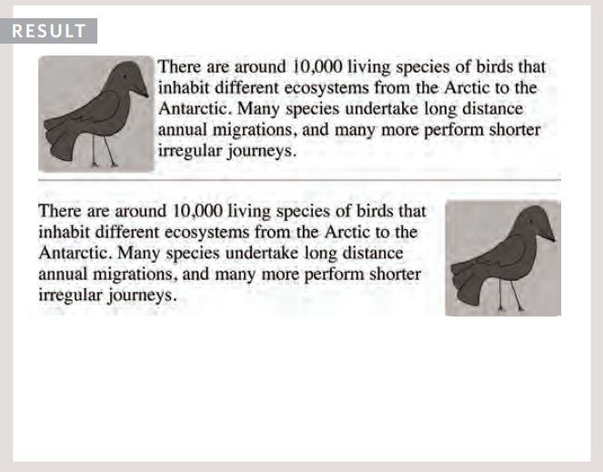
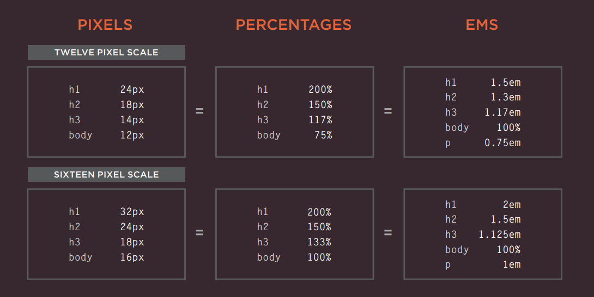

# Images

images can be easily inserted at any section in HTML page . to insert in an HTML page , we use the img tag. 

## Adding Images

To add an image into the page 
you need to use an <b style= color:blue> img</b>
element. This is an empty 
element (which means there is 
no closing tag).

**src**
this tells the browser where it can find the image file

**alt**
Tis prvide a text This description 
of the image that describes the image if you can not see it.

## Height & Width of Images

### height
This specifies the height of the 
image in pixels.

### width
This specifies the width of the image in pixeles.

## Aligning Images Horizontally
left:

This aligns the image to the left 
(allowing text to flow around its 
right-hand side)

right:

This aligns the image to the right 
(allowing text to flow around its 
left-hand side).

top:

This aligns the first line of the surrounding text with the top of the image .

bottom:

This aligns the first line of the sueeonding text with the bottom of the image .

# Color

## Foreground Color

### rgb values
These express collors in terms of how much red, green and blue are used to make it up. For 
example: rgb(100,100,90)

## hex codes
These are six-digit codes that 
represent the amount of red, 
green and blue in a color, 
preceded by a pound or hash # 
sign. For example: #ee3e80

## color names
There are 147 predefined color 
names that are recognized 
by browsers. For example: 
DarkCyan

## background-color

CSS treats each HTML element 
as if it appears in a box, and the 
background-color property 
sets the color of the background 
for that box.

## Hue
hue is often represented as a color circle 
where the angle represents the 
color.

## Saturation
 is the amount of gray in a color. Saturation is 
represented as a percentage. 
100% is full saturation and 0% 
is a shade of gray

## lightness

Lightness is the amount of 
white (lightness) or black 
(darkness) in a color

# Text

## Choosing a Typeface for your Website

1. Serif
1. Sans-Serif
1. Monospace
1. Cursive
1. Fantasy

## Type Scales

You may have noticed that programs such as 
Word, Photoshop and InDesign offer the same 
sizes of text.

## Units of Type Siz

# JPEG vs PNG vs GIF 

Several statistics reports indicate that these 3 formats together comprise of more than 95% of all images loaded on websites

## JPEG

 is a lossy compression specification that takes advantage of human perception. It can achieve compression ratios of 1:10 without any perceivable difference in quality.

 ## PNG

  is a lossless image format using DEFLATE compression. No data is lost during compression and no compression artefacts are introduced in the image.

  ## GIF 
  
  is also a lossless image format that uses LZW compression algorithm.