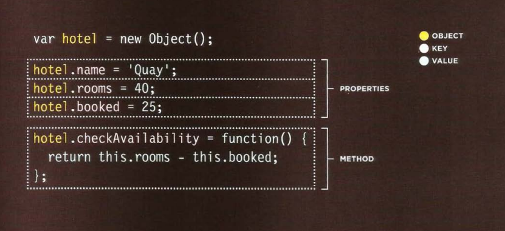

# Domain Modeling

Domain modeling is the process of creating a conceptual model in code for a specific problem. A model describes the various entities, their attributes and behaviors, as well as the constraints that govern the problem domain

# Tables

## What's a Table?

A table represents information in a grid format. 
Examples of tables include financial reports, TV 
schedules, and sports results

### Table Headings **th**

The th element is used just 
like the td element but its 
purpose is to represent the 
heading for either a column or 
a row

### Long Tables

There are three elements that 
help distinguish between the 
main content of

**thead**

The headings of the table should 
sit inside the thead element. 

**tbody**

The body should sit inside the 
tbody element.

**tfoot**

The footer belongs inside the 
tfoot element

# CRATING AN OBJECT : CONSTRUCTOR NATION.

## ADDING AND REMOVING PROPERTIES

### THIS (IT IS A KEYWORD) 

The keyword this is commonly used inside functions and objects. 
Where the function is declared alters what this means. It always refers 
to one object, usually the object in which the function operates.

### RECAP: STORING DATA 

In JavaScript, data is represented using name/value pairs. 
To organize your data, you can use an array or object to group a set of 
related values. In arrays and objects the name is also known as a key. 

### WHAT ARE BUILT-IN OBJECTS?

Browsers come with a set of built-in objects that represent things like the 
browser window and the current web page shown in that window. These 
built-in objects act like a toolkit for creating interactive web pages. 

### GLOBAL OBJECTS: STRING O BJECT

Whenever you have a value that is a string, you can use the properties 
and methods of the String object on that value. This example stores the 
phrase "Home sweet home " in a variable.

### DATA TYPES REVISITED 

In JavaScript there are six data types: 
Five of them are described as simple (or primitive) data types. 
The sixth is the object (and is referred to as a complex data type).

