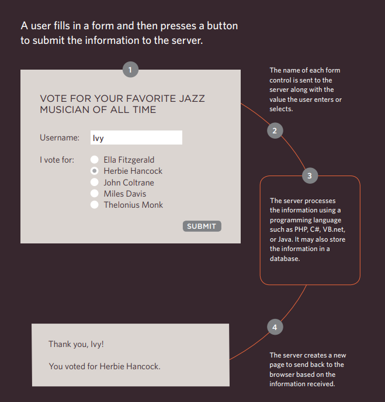
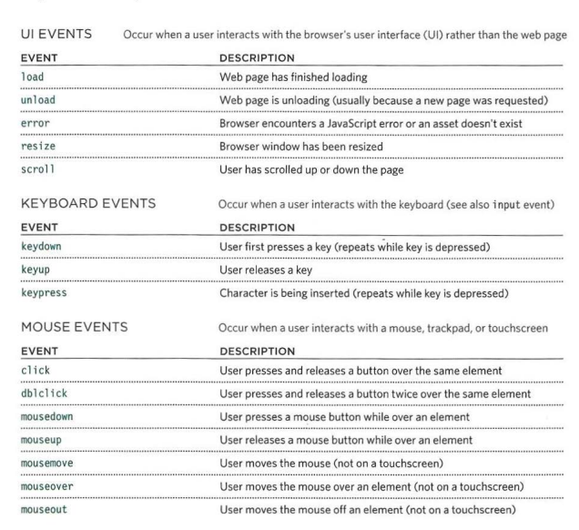

# Forms
form represents a adocument section containig interactive controls for submitting information. like search boxes

forms hae several types and i will outline some of them:

## ADDING TEXT:

### text input

it used for insert a text such as emails.

### passward 

like single line text

### text area

it is used for longer aread of text such as messages

there is also some types of forms that make you make choises like:

* radio buttons
* check boxes
* Drop down boxes

## How does forms work?

simply:

to defferentiate between defferent input data the form contain of two main types:

* name it is the name of button and so on
* value where the user unput his information

# LISTS

lists allow us to put many things under each other like pullets

## Table properities 

tables have many properities like:
* width : to set the wedth of the table
* padding: to set spaces between the border of each table

text-transform: to convert the table content to the upper case
 and so many other propereties

 ther is something called hover it is used to change the appearance of button color.

 # EVENTS 

 events is that when the user brwos the web , the brwoser register diferrent type events.

 ther are different types of events :

 

 what is the functionallety of the events?

 1- select the element you wanmt the script respond to

 2- indicate wich event on the selected node will trigger the response

 3- stste the code you want to run
