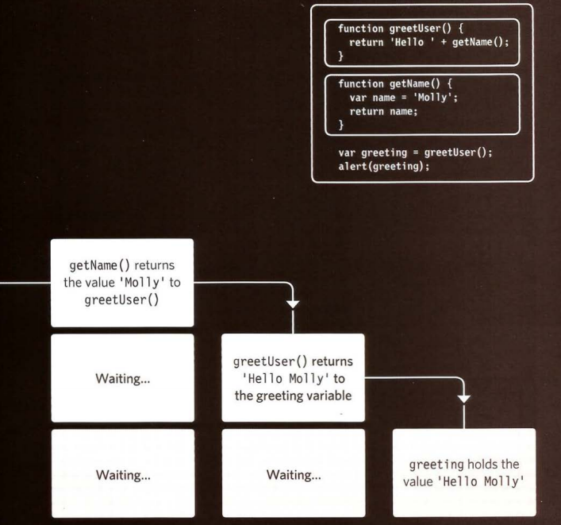

# Error Handling & Debugging

debugging is mainly about assisting us to find errors in ourcode and how to avoid it.

## order of excution

it helps us to find the source of an error , and give us an idea of how the script works, as example the code cant run until another statement has been run.

## execution contexts

every statement in a script lives in one of three execution contexts:
1- global context: code that is in the script but not in the function 

2- eval context: text is excuted in enternal functin called eval()

3-glopal scope: it is when a variable declared outside the function it can used anywhere because it has a global scope

## understanding scope

each execution ha its own variables object and it holds functions and parameters within it 

and about the errors when it happens the java script throws an exception, and at this point the interpreter stops and see for exception handling code.

in abbriviation way the java script has 7 different types of errors, and the console helps us to find the location of the error