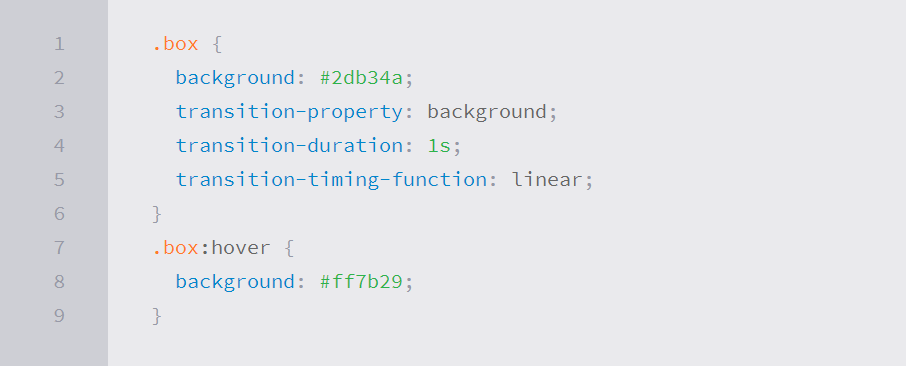

# Transforms

The transform property comes in two different settings, two-dimensional and three-dimensional. Each of these come with their own individual properties and values.

## Transform Syntax

The actual syntax for the transform property is quite simple, including the transform property followed by the value. The value specifies the transform type followed by a specific amount inside parentheses.

## 2D Transforms

 Two-dimensional transforms work on the x and y axes, known as horizontal and vertical axes. Three-dimensional transforms work on both the x and y axes, as well as the z axis. These three-dimensional transforms help define not only the length and width of an element, but also the depth. 

 ## 2D Rotate

The transform property accepts a handful of different values. The rotate value provides the ability to rotate an element from 0 to 360 degrees. Using a positive value will rotate an element clockwise, and using a negative value will rotate the element counterclockwise.

## Transitions & Animations

With CSS3 transitions you have the potential to alter the appearance and behavior of an element whenever a state change occurs, such as when it is hovered over, focused on, active, or targeted.

## Transitions

There are four transition related properties in total, including transition-property, transition-duration, transition-timing-function, and transition-delay. Not all of these are required to build a transition, with the first three are the most popular.

## Transitional Property

The transition-property property determines exactly what properties will be altered in conjunction with the other transitional properties. By default, all of the properties within an element’s different states will be altered upon change. 

If multiple properties need to be transitioned they may be comma separated within the transition-property value. Additionally, the keyword value all may be used to transition all properties of an element.

## Transition Duration

The duration in which a transition takes place is set using the transition-duration property. The value of this property can be set using general timing values, including seconds (s) and milliseconds (ms).

When transitioning multiple properties you can set multiple durations, one for each property. As with the transition-property property value, multiple durations can be declared using comma separated values. The order of these values when identifying individual properties and durations does matter

