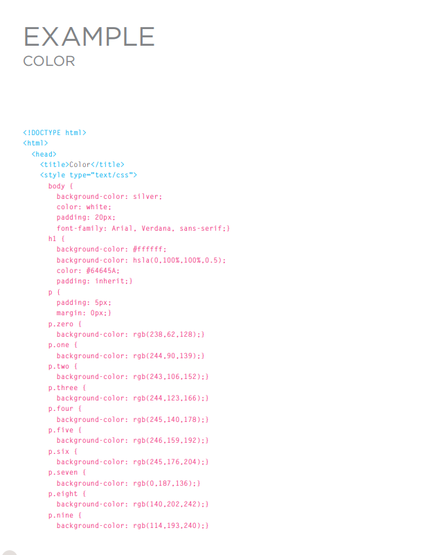

# Color can really bring your pages to life!.

*The color property allows you 
to specify the color of text inside 
an element. You can specify any 
color in CSS in one of three ways:*
1. ## rgb values:
*These express colors in terms 
of how much red, green and 
blue are used to make it up. For 
example: rgb(100,100,90)*

*Values for red, green, and blue 
are expressed as numbers 
between 0 and 255.*

2. ## hex codes: 
*These are six-digit codes that 
represent the amount of red, 
green and blue in a color, 
preceded by a pound or hash # 
sign. For example: #ee3e80*

*Hex values represent values 
for red, green, and blue in 
hexadecimal code.*

3. ## color names:
*There are 147 predefined color 
names that are recognized 
by browsers. For example: 
DarkCyan
We look at these three different 
ways of specifying colors on the 
next double-page spread.*

*Colors are represented by 
predefined names. However, 
they are very limited in number*

## background-color
*CSS treats each HTML element 
as if it appears in a box, and the 
background-color property 
sets the color of the background 
for that box.
You can specify your choice of 
background color in the same 
three ways you can specify 
foreground colors: RGB values, 
hex codes, and color names 
(covered on the next page).*

## Understanding Color

*Every color on a computer screen is created by mixing amounts of red, 
green, and blue. To find the color you want, you can use a color picker.*

## CSS3: HSL Colors

* # hue:
*Hue is the colloquial idea of 
color. In HSL colors, hue is often 
represented as a color circle 
where the angle represents the 
color, although it may also be 
shown as a slider with values 
from 0 to 360.*

*This is expressed as an angle 
(between 0 and 360 degrees)*

* # saturation
*Saturation is the amount of 
gray in a color. Saturation is 
represented as a percentage. 
100% is full saturation and 0% 
is a shade of gray.*

*This is expressed as a 
percentage.*

* # lightness
*Lightness is the amount of 
white (lightness) or black 
(darkness) in a color. Lightness 
is represented as a percentage. 
0% lightness is black, 100% 
lightness is white, and 50% 
lightness is normal. Lightness 
is sometimes referred to as 
luminosity*

*This is expressed as a 
percentage with 0% being white, 
50% being normal, and 100% 
being black.*

