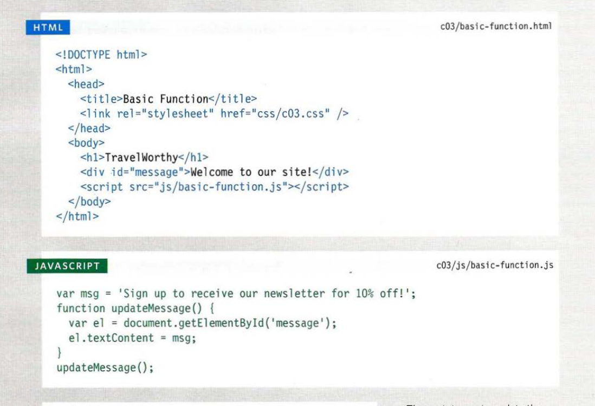

# 
**WRITING A SCRIPT**

**To write a script, you need to first 
state your goal and then list the 
tasks that need to be completed in 
order to achieve it. and Start with the big picture of what 
you want to achieve, and break 
that down into smaller steps.**

1. **
DEFINE THE GOAL
 
First, you need to define the task you want to 
achieve. You can think of this as a puzzle for the 
computer to solve.**

2. **
DESIGN THE SCRIPT

To design a script you split the goal out into a series 
of tasks that are going to be involved in solving this 
puzzle. This can be represented using a flowchart. 
You can then write down individual steps that the 
computer needs to perform in order to complete 
each individual task (and any information it needs to 
perform the task), rather like writing a recipe that it 
can follow.** 
3. **
CODE EACH STEP
  
Each of the steps needs to be written in a 
programming language that the compu ter 
understands. In our case, this is JavaScript. 
As tempting as it can be to start coding straight 
away, it pays to spend time designing your script 
before you start writing it**

## 
**EXPRESSIONS**

**An expression evaluates into (results in) a single value. Broadly speaking 
there are two types of expressions.**

1. **EXPRESSIONS THAT JUST ASSIGN A 
VALUE TO A VARIABLE**

2. **EXPRESSIONS THAT USE TWO OR 
MORE VALUES TO RETURN A 
SINGLE VALUE**

## 
**OPERATORS**

**Expressions rely on things called operators; they allow programmers to 
create a single value from one or more values.**

<ul>

**<li>ASSIGNMENT OPERATORS</li>**
**<li>ARITHMETIC OPERATORS</li>**
**<li>STRING OPERATORS </li>**
**<li>COMPARISON OPERATORS</li>**
**<li>LOGICAL OPERATORS</li>**

</ul>

## **
ARITHMETI C OPERATORS
**

**<h2 style=color:green>WHAT IS A FUNCTION? </h2>**

**Functions let you group a series of statements together to perform a 
specific task. If different parts of a script repeat the same task, you can 
reuse the function (rather than repeating the same set of statements).**

**<h2 style=color:green > BASIC FUNCTION:  </h2>**

**In this example, the user is 
shown a message at the top of 
the page. The message is held 
in an HTML element whose id 
attribute has a value of message. 
The message is going to be 
changed using JavaScript.**

